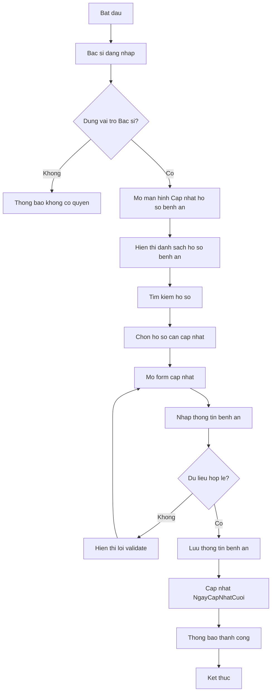
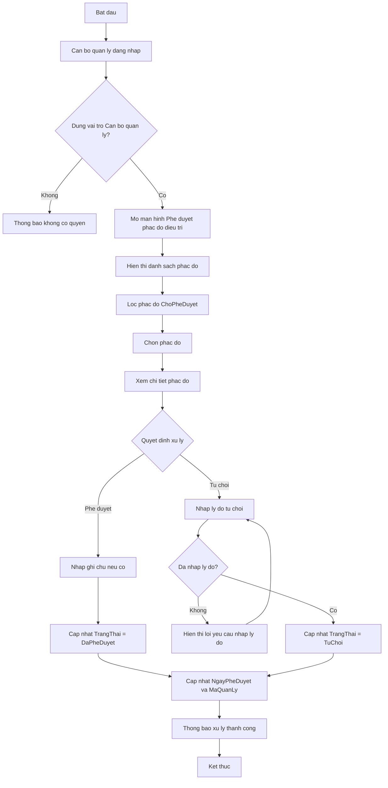

# ĐẶC TẢ PHẦN VIỆC CỦA NGUYỄN MINH VỸ

## Đề tài

**Website Quản lý Trung tâm Cai nghiện Ma túy Thành phố Đà Nẵng**

## Mục đích tài liệu

Tài liệu này mô tả cụ thể phần việc Nguyễn Minh Vỹ cần thực hiện theo đúng phân công của giảng viên. Nội dung tập trung vào **giao diện**, **chức năng**, **dữ liệu liên quan** và **luồng hoạt động nghiệp vụ**.

Vỹ chỉ làm đúng các chức năng được gắn tên **Vỹ** trong bảng phân công của nhóm. Các chức năng của thành viên khác không hiển thị trong menu, không thiết kế màn hình riêng và không xử lý nghiệp vụ.

---

# 1. PHẠM VI CÔNG VIỆC CỦA VỸ

## 1.1. Chức năng được phân công

| STT | Actor | Chức năng | Người phụ trách |
|---|---|---|---|
| 1 | Cán bộ phụ trách / Bác sĩ | Cập nhật hồ sơ bệnh án người cai nghiện | Vỹ |
| 2 | Cán bộ quản lý | Phê duyệt phác đồ điều trị | Vỹ |

## 1.2. Chức năng không thuộc phạm vi của Vỹ

Các chức năng dưới đây không thuộc phần Vỹ làm, vì vậy không hiển thị trong giao diện của Vỹ:

| Actor | Chức năng không làm |
|---|---|
| Bác sĩ | Cập nhật nhật ký điều trị |
| Bác sĩ | Lập phác đồ điều trị |
| Bác sĩ | Cập nhật lịch uống thuốc |
| Bác sĩ | Cập nhật lịch tư vấn tâm lý |
| Bác sĩ | Gửi đề xuất chuyển giai đoạn điều trị |
| Bác sĩ | Gửi đề xuất hoàn thành cai nghiện |
| Cán bộ quản lý | Phân công cán bộ phụ trách |
| Cán bộ quản lý | Phê duyệt thay đổi giai đoạn điều trị |
| Cán bộ quản lý | Xem báo cáo tổng quan |

## 1.3. Nguyên tắc thực hiện

| Nguyên tắc | Mô tả |
|---|---|
| Đúng phân công | Chỉ làm 2 chức năng của Vỹ |
| Đúng actor | Chức năng bệnh án thuộc Bác sĩ, chức năng phê duyệt phác đồ thuộc Cán bộ quản lý |
| Đúng luồng nghiệp vụ | Không chỉ làm giao diện, phải thể hiện được quy trình thao tác từ đăng nhập đến xử lý dữ liệu |
| Đúng dữ liệu | Giao diện phải bám theo các bảng CSDL liên quan |
| Không làm dư | Không hiển thị chức năng của thành viên khác |
| Dễ tích hợp backend | Chuẩn bị sẵn API để sau này nối Java/Spring Boot |

---

# 2. DANH SÁCH GIAO DIỆN VỸ CẦN LÀM

Vỹ cần làm khoảng **5 giao diện chính** và một số modal hỗ trợ.

| STT | Giao diện | Actor sử dụng | Mục đích |
|---|---|---|---|
| 1 | Đăng nhập hệ thống | Chung | Cho phép đăng nhập demo theo vai trò Bác sĩ hoặc Cán bộ quản lý |
| 2 | Dashboard Bác sĩ | Cán bộ phụ trách / Bác sĩ | Hiển thị tổng quan hồ sơ bệnh án và menu chức năng bệnh án |
| 3 | Cập nhật hồ sơ bệnh án người cai nghiện | Cán bộ phụ trách / Bác sĩ | Xem, tìm kiếm, cập nhật hồ sơ bệnh án |
| 4 | Dashboard Cán bộ quản lý | Cán bộ quản lý | Hiển thị tổng quan phác đồ điều trị chờ duyệt |
| 5 | Phê duyệt phác đồ điều trị | Cán bộ quản lý | Xem, phê duyệt hoặc từ chối phác đồ điều trị |

## 2.1. Modal hỗ trợ

| STT | Modal | Dùng cho giao diện | Mục đích |
|---|---|---|---|
| 1 | Modal xem chi tiết bệnh án | Cập nhật hồ sơ bệnh án | Xem đầy đủ thông tin bệnh án |
| 2 | Modal cập nhật bệnh án | Cập nhật hồ sơ bệnh án | Cập nhật thông tin bệnh án |
| 3 | Modal xem chi tiết phác đồ | Phê duyệt phác đồ điều trị | Xem đầy đủ nội dung phác đồ trước khi duyệt |
| 4 | Modal phê duyệt phác đồ | Phê duyệt phác đồ điều trị | Nhập ghi chú và xác nhận phê duyệt |
| 5 | Modal từ chối phác đồ | Phê duyệt phác đồ điều trị | Nhập lý do từ chối |

---

# 3. CẤU TRÚC THƯ MỤC ĐỀ XUẤT CHO PHẦN CỦA VỸ

```text
vy-module-fe/
│
├── index.html
├── login.html
├── dashboard.html
│
├── css/
│   └── style.css
│
├── js/
│   ├── main.js
│   ├── auth.js
│   ├── api.js
│   ├── medical-record.js
│   └── treatment-approval.js
│
└── README.md
```

## 3.1. Vai trò từng file

| File | Vai trò |
|---|---|
| index.html | Trang điều hướng ban đầu, có thể chuyển sang login |
| login.html | Giao diện đăng nhập demo |
| dashboard.html | Giao diện dashboard dùng chung, nội dung thay đổi theo role |
| css/style.css | Toàn bộ style cho giao diện |
| js/auth.js | Xử lý đăng nhập, đăng xuất, kiểm tra role |
| js/api.js | Chuẩn bị hàm gọi API sau này nối Java/Spring Boot |
| js/main.js | Khởi tạo layout, sidebar, topbar, điều hướng màn hình |
| js/medical-record.js | Xử lý giao diện và nghiệp vụ cập nhật hồ sơ bệnh án |
| js/treatment-approval.js | Xử lý giao diện và nghiệp vụ phê duyệt phác đồ điều trị |
| README.md | Mô tả cách chạy và phạm vi chức năng của Vỹ |

---

# 4. GIAO DIỆN 1: ĐĂNG NHẬP HỆ THỐNG

## 4.1. Mục tiêu

Cho phép Vỹ demo đăng nhập theo đúng 2 vai trò liên quan:

- Cán bộ phụ trách / Bác sĩ
- Cán bộ quản lý

## 4.2. Thành phần giao diện

| Thành phần | Mô tả |
|---|---|
| Logo hệ thống | RehabCare Đà Nẵng hoặc Trung tâm Cai nghiện Đà Nẵng |
| Tên đăng nhập | Ô nhập username |
| Mật khẩu | Ô nhập password |
| Vai trò | Select chọn Bác sĩ hoặc Cán bộ quản lý |
| Nút đăng nhập | Kiểm tra thông tin và chuyển vào dashboard |
| Thông báo lỗi | Hiển thị khi thiếu thông tin hoặc sai tài khoản |

## 4.3. Tài khoản demo đề xuất

| Vai trò | Username | Password |
|---|---|---|
| Bác sĩ | doctor | 123456 |
| Cán bộ quản lý | manager | 123456 |

## 4.4. Luồng đăng nhập

| Bước | Người thực hiện | Hành động | Kết quả |
|---|---|---|---|
| 1 | Người dùng | Mở trang đăng nhập | Hệ thống hiển thị form đăng nhập |
| 2 | Người dùng | Nhập username, password, chọn vai trò | Hệ thống nhận dữ liệu |
| 3 | Hệ thống | Kiểm tra dữ liệu nhập | Nếu thiếu thông tin thì báo lỗi |
| 4 | Hệ thống | Kiểm tra tài khoản demo | Nếu hợp lệ thì lưu user vào localStorage |
| 5 | Hệ thống | Điều hướng theo vai trò | Bác sĩ vào dashboard bác sĩ, cán bộ quản lý vào dashboard quản lý |

## 4.5. Điều kiện kiểm tra

| Điều kiện | Xử lý |
|---|---|
| Chưa nhập username | Báo lỗi: Vui lòng nhập tên đăng nhập |
| Chưa nhập password | Báo lỗi: Vui lòng nhập mật khẩu |
| Chưa chọn vai trò | Báo lỗi: Vui lòng chọn vai trò |
| Sai tài khoản | Báo lỗi: Tài khoản hoặc mật khẩu không đúng |
| Đúng tài khoản | Chuyển vào dashboard tương ứng |

---

# 5. GIAO DIỆN 2: DASHBOARD BÁC SĨ

## 5.1. Mục tiêu

Dashboard Bác sĩ là màn hình tổng quan sau khi đăng nhập bằng vai trò **Cán bộ phụ trách / Bác sĩ**.

## 5.2. Quy tắc hiển thị menu

Sidebar của Bác sĩ chỉ được hiển thị đúng chức năng Vỹ được phân công:

| Menu | Có hiển thị không? | Lý do |
|---|---|---|
| Cập nhật hồ sơ bệnh án | Có | Đây là chức năng của Vỹ |
| Cập nhật nhật ký điều trị | Không | Không thuộc phần Vỹ |
| Lập phác đồ điều trị | Không | Không thuộc phần Vỹ |
| Cập nhật lịch uống thuốc | Không | Không thuộc phần Vỹ |
| Cập nhật lịch tư vấn tâm lý | Không | Không thuộc phần Vỹ |
| Gửi đề xuất chuyển giai đoạn | Không | Không thuộc phần Vỹ |
| Gửi đề xuất hoàn thành cai nghiện | Không | Không thuộc phần Vỹ |

## 5.3. Thành phần giao diện

| Khu vực | Nội dung |
|---|---|
| Sidebar | Logo, menu Cập nhật hồ sơ bệnh án |
| Topbar | Tên người dùng, vai trò, nút đăng xuất |
| Card thống kê | Tổng hồ sơ bệnh án, hồ sơ đã cập nhật, hồ sơ cần cập nhật |
| Nội dung chính | Danh sách bệnh án gần đây |

## 5.4. Luồng hoạt động

| Bước | Người thực hiện | Hành động | Kết quả |
|---|---|---|---|
| 1 | Bác sĩ | Đăng nhập hệ thống | Hệ thống xác định role là Bác sĩ |
| 2 | Hệ thống | Render dashboard Bác sĩ | Chỉ hiển thị menu Cập nhật hồ sơ bệnh án |
| 3 | Bác sĩ | Click menu Cập nhật hồ sơ bệnh án | Chuyển sang màn hình danh sách bệnh án |

---

# 6. GIAO DIỆN 3: CẬP NHẬT HỒ SƠ BỆNH ÁN NGƯỜI CAI NGHIỆN

## 6.1. Thông tin chung

| Nội dung | Chi tiết |
|---|---|
| Tên chức năng | Cập nhật hồ sơ bệnh án người cai nghiện |
| Actor | Cán bộ phụ trách / Bác sĩ |
| Bảng dữ liệu chính | HOSOBENHAN |
| Mục tiêu | Cho phép bác sĩ xem, tìm kiếm và cập nhật thông tin bệnh án của người cai nghiện |

## 6.2. Bảng CSDL liên quan: HOSOBENHAN

| Tên trường | Kiểu dữ liệu | Ràng buộc | Mô tả |
|---|---|---|---|
| MaBenhAn | CHAR(10) | PK | Mã bệnh án |
| MaNguoiCaiNghien | CHAR(12) | FK, NOT NULL | Mã người cai nghiện |
| MaBacSi | CHAR(10) | FK, NOT NULL | Mã bác sĩ phụ trách |
| TienSuBenh | NVARCHAR(500) | NULL | Tiền sử bệnh lý của người cai nghiện |
| DiUng | NVARCHAR(500) | NULL | Thông tin dị ứng thuốc, thực phẩm hoặc yếu tố khác |
| ChieuCao | DECIMAL(5,2) | NULL | Chiều cao của người cai nghiện |
| CanNang | DECIMAL(5,2) | NULL | Cân nặng của người cai nghiện |
| NgayLap | DATETIME | NOT NULL | Ngày lập hồ sơ bệnh án |
| NgayCapNhatCuoi | DATETIME | NOT NULL | Thời điểm cập nhật hồ sơ bệnh án gần nhất |

## 6.3. Thành phần giao diện

| Thành phần | Mô tả |
|---|---|
| Tiêu đề trang | Cập nhật hồ sơ bệnh án |
| Ô tìm kiếm | Tìm theo mã bệnh án hoặc mã người cai nghiện |
| Bộ lọc | Có thể lọc hồ sơ cần cập nhật hoặc đã cập nhật |
| Bảng danh sách | Hiển thị danh sách hồ sơ bệnh án |
| Nút xem chi tiết | Mở modal xem thông tin bệnh án |
| Nút cập nhật | Mở form/modal cập nhật bệnh án |
| Toast thông báo | Hiển thị kết quả lưu dữ liệu |

## 6.4. Cột dữ liệu trên bảng danh sách

| Cột | Mô tả |
|---|---|
| Mã bệnh án | Hiển thị MaBenhAn |
| Mã người cai nghiện | Hiển thị MaNguoiCaiNghien |
| Mã bác sĩ | Hiển thị MaBacSi |
| Tiền sử bệnh | Hiển thị tóm tắt TienSuBenh |
| Dị ứng | Hiển thị tóm tắt DiUng |
| Chiều cao | Hiển thị ChieuCao |
| Cân nặng | Hiển thị CanNang |
| Ngày lập | Hiển thị NgayLap |
| Cập nhật cuối | Hiển thị NgayCapNhatCuoi |
| Thao tác | Xem chi tiết, Cập nhật |

## 6.5. Form cập nhật hồ sơ bệnh án

| Trường | Kiểu nhập | Bắt buộc | Ghi chú |
|---|---|---|---|
| Mã bệnh án | Text | Có | Nên để readonly vì là khóa chính |
| Mã người cai nghiện | Text | Có | Nên để readonly vì liên kết hồ sơ |
| Mã bác sĩ | Text | Có | Có thể lấy từ tài khoản đăng nhập |
| Tiền sử bệnh | Textarea | Không | Cho phép bác sĩ cập nhật |
| Dị ứng | Textarea | Không | Cho phép bác sĩ cập nhật |
| Chiều cao | Number | Không | Đơn vị cm |
| Cân nặng | Number | Không | Đơn vị kg |
| Ngày lập | Datetime | Có | Readonly |
| Ngày cập nhật cuối | Datetime | Có | Tự động cập nhật theo thời gian hiện tại |

## 6.6. Luồng hoạt động cập nhật hồ sơ bệnh án

| Bước | Actor/Hệ thống | Hành động | Kết quả |
|---|---|---|---|
| 1 | Bác sĩ | Đăng nhập hệ thống | Hệ thống xác định người dùng có vai trò Bác sĩ |
| 2 | Bác sĩ | Chọn menu Cập nhật hồ sơ bệnh án | Hệ thống hiển thị danh sách hồ sơ bệnh án |
| 3 | Bác sĩ | Tìm kiếm hồ sơ theo mã bệnh án hoặc mã người cai nghiện | Hệ thống lọc danh sách tương ứng |
| 4 | Bác sĩ | Chọn Xem chi tiết | Hệ thống hiển thị chi tiết hồ sơ bệnh án |
| 5 | Bác sĩ | Chọn Cập nhật | Hệ thống mở form cập nhật |
| 6 | Bác sĩ | Nhập/chỉnh sửa thông tin bệnh án | Hệ thống chờ thao tác lưu |
| 7 | Bác sĩ | Bấm Lưu thay đổi | Hệ thống kiểm tra dữ liệu nhập |
| 8 | Hệ thống | Validate dữ liệu | Nếu hợp lệ thì cập nhật hồ sơ bệnh án |
| 9 | Hệ thống | Cập nhật NgayCapNhatCuoi bằng thời gian hiện tại | Dữ liệu được lưu thành công |
| 10 | Hệ thống | Hiển thị thông báo thành công | Bác sĩ thấy thông báo Cập nhật hồ sơ bệnh án thành công |

## 6.7. Luồng thay thế và ngoại lệ

| Trường hợp | Cách xử lý |
|---|---|
| Không tìm thấy hồ sơ | Hiển thị thông báo: Không tìm thấy hồ sơ bệnh án phù hợp |
| Người dùng không phải Bác sĩ truy cập | Chuyển đến trang 403 hoặc thông báo không có quyền |
| Thiếu mã bệnh án | Báo lỗi: Vui lòng nhập mã bệnh án |
| Thiếu mã người cai nghiện | Báo lỗi: Vui lòng nhập mã người cai nghiện |
| Thiếu mã bác sĩ | Báo lỗi: Vui lòng nhập mã bác sĩ |
| Chiều cao không hợp lệ | Báo lỗi: Chiều cao phải là số hợp lệ |
| Cân nặng không hợp lệ | Báo lỗi: Cân nặng phải là số hợp lệ |
| Lỗi lưu dữ liệu | Hiển thị thông báo: Cập nhật thất bại, vui lòng thử lại |

## 6.8. Activity flow dạng Mermaid



## 6.9. API cần chuẩn bị

| Phương thức | Endpoint | Mục đích |
|---|---|---|
| GET | /api/medical-records | Lấy danh sách hồ sơ bệnh án |
| GET | /api/medical-records/{id} | Lấy chi tiết một hồ sơ bệnh án |
| PUT | /api/medical-records/{id} | Cập nhật hồ sơ bệnh án |

## 6.10. Dữ liệu gửi khi cập nhật

```json
{
  "maBenhAn": "BA001",
  "maNguoiCaiNghien": "NCN001",
  "maBacSi": "BS001",
  "tienSuBenh": "Từng điều trị rối loạn giấc ngủ",
  "diUng": "Không ghi nhận dị ứng",
  "chieuCao": 170.5,
  "canNang": 62.0,
  "ngayCapNhatCuoi": "2026-06-15T10:30:00"
}
```

---

# 7. GIAO DIỆN 4: DASHBOARD CÁN BỘ QUẢN LÝ

## 7.1. Mục tiêu

Dashboard Cán bộ quản lý là màn hình tổng quan sau khi đăng nhập bằng vai trò **Cán bộ quản lý**.

## 7.2. Quy tắc hiển thị menu

Sidebar của Cán bộ quản lý chỉ được hiển thị đúng chức năng Vỹ được phân công:

| Menu | Có hiển thị không? | Lý do |
|---|---|---|
| Phê duyệt phác đồ điều trị | Có | Đây là chức năng của Vỹ |
| Phân công cán bộ phụ trách | Không | Không thuộc phần Vỹ |
| Phê duyệt thay đổi giai đoạn điều trị | Không | Không thuộc phần Vỹ |
| Xem báo cáo tổng quan | Không | Không thuộc phần Vỹ |

## 7.3. Thành phần giao diện

| Khu vực | Nội dung |
|---|---|
| Sidebar | Logo, menu Phê duyệt phác đồ điều trị |
| Topbar | Tên người dùng, vai trò, nút đăng xuất |
| Card thống kê | Phác đồ chờ duyệt, đã phê duyệt, bị từ chối |
| Nội dung chính | Danh sách phác đồ điều trị chờ duyệt gần đây |

## 7.4. Luồng hoạt động

| Bước | Người thực hiện | Hành động | Kết quả |
|---|---|---|---|
| 1 | Cán bộ quản lý | Đăng nhập hệ thống | Hệ thống xác định role là Cán bộ quản lý |
| 2 | Hệ thống | Render dashboard Cán bộ quản lý | Chỉ hiển thị menu Phê duyệt phác đồ điều trị |
| 3 | Cán bộ quản lý | Click menu Phê duyệt phác đồ điều trị | Chuyển sang màn hình danh sách phác đồ điều trị |

---

# 8. GIAO DIỆN 5: PHÊ DUYỆT PHÁC ĐỒ ĐIỀU TRỊ

## 8.1. Thông tin chung

| Nội dung | Chi tiết |
|---|---|
| Tên chức năng | Phê duyệt phác đồ điều trị |
| Actor | Cán bộ quản lý |
| Bảng dữ liệu chính | PHACDODIEUTRI |
| Mục tiêu | Cho phép cán bộ quản lý xem xét, phê duyệt hoặc từ chối phác đồ điều trị do bác sĩ lập |

## 8.2. Bảng CSDL liên quan: PHACDODIEUTRI

| Tên trường | Kiểu dữ liệu | Ràng buộc | Mô tả |
|---|---|---|---|
| MaPhacdoDT | CHAR(10) | PK | Mã phác đồ điều trị |
| MaBenhAn | CHAR(10) | FK, NOT NULL | Mã bệnh án áp dụng phác đồ |
| MaBacSi | CHAR(10) | FK, NOT NULL | Mã bác sĩ lập phác đồ |
| MaQuanLy | CHAR(10) | FK, NOT NULL | Mã cán bộ quản lý phê duyệt phác đồ |
| LoaiMaTuy | VARCHAR(50) | NOT NULL | Loại ma túy liên quan đến phác đồ |
| GiaiDoan | VARCHAR(50) | NOT NULL | Giai đoạn điều trị |
| NoiDungPhacdoDT | VARCHAR(500) | NOT NULL | Nội dung chi tiết của phác đồ điều trị |
| MucTieu | VARCHAR(500) | NOT NULL | Mục tiêu điều trị |
| NgayBatDau | DATE | NOT NULL | Ngày bắt đầu áp dụng phác đồ |
| NgayKetThucDuKien | DATE | NOT NULL | Ngày kết thúc dự kiến |
| TrangThai | VARCHAR(30) | NOT NULL | Trạng thái phác đồ điều trị |
| NgayPheDuyet | DATETIME | NULL | Ngày phác đồ được phê duyệt hoặc từ chối |
| GhiChuPheDuyet | VARCHAR(500) | NULL | Ghi chú phê duyệt hoặc lý do từ chối |

## 8.3. Trạng thái phác đồ điều trị

| Giá trị trạng thái | Ý nghĩa | Ai cập nhật | Có thuộc phần Vỹ không? |
|---|---|---|---|
| ChoPheDuyet | Phác đồ đã được bác sĩ lập và đang chờ cán bộ quản lý xem xét | Bác sĩ khi lập phác đồ | Không tạo, nhưng Vỹ cần hiển thị |
| DaPheDuyet | Phác đồ đã được cán bộ quản lý phê duyệt | Cán bộ quản lý | Có |
| TuChoi | Phác đồ bị cán bộ quản lý từ chối | Cán bộ quản lý | Có |
| DangApDung | Phác đồ đang được áp dụng trong quá trình điều trị | Hệ thống hoặc nghiệp vụ điều trị sau khi được duyệt | Không xử lý chính, chỉ hiển thị nếu có |
| HoanThanh | Phác đồ đã hoàn thành | Hệ thống hoặc cán bộ phụ trách sau quá trình điều trị | Không xử lý chính, chỉ hiển thị nếu có |

## 8.4. Luồng trạng thái Vỹ cần xử lý

| Trạng thái ban đầu | Hành động | Trạng thái sau xử lý | Ghi chú |
|---|---|---|---|
| ChoPheDuyet | Bấm Phê duyệt | DaPheDuyet | Cập nhật NgayPheDuyet và GhiChuPheDuyet nếu có |
| ChoPheDuyet | Bấm Từ chối | TuChoi | Bắt buộc nhập lý do từ chối vào GhiChuPheDuyet |

## 8.5. Luồng trạng thái chỉ hiển thị, không xử lý

| Trạng thái | Cách hiển thị |
|---|---|
| DaPheDuyet | Chỉ cho xem chi tiết, không cho duyệt lại |
| TuChoi | Chỉ cho xem chi tiết, không cho duyệt lại |
| DangApDung | Chỉ cho xem chi tiết, không cho duyệt/từ chối |
| HoanThanh | Chỉ cho xem chi tiết, không cho duyệt/từ chối |

## 8.6. Thành phần giao diện

| Thành phần | Mô tả |
|---|---|
| Tiêu đề trang | Phê duyệt phác đồ điều trị |
| Card thống kê | Tổng phác đồ, chờ duyệt, đã duyệt, từ chối |
| Bộ lọc trạng thái | Lọc ChoPheDuyet, DaPheDuyet, TuChoi, DangApDung, HoanThanh |
| Ô tìm kiếm | Tìm theo mã phác đồ, mã bệnh án hoặc mã bác sĩ |
| Bảng danh sách | Hiển thị danh sách phác đồ điều trị |
| Nút xem chi tiết | Xem đầy đủ nội dung phác đồ |
| Nút phê duyệt | Chỉ hiện khi TrangThai = ChoPheDuyet |
| Nút từ chối | Chỉ hiện khi TrangThai = ChoPheDuyet |
| Toast thông báo | Hiển thị kết quả xử lý |

## 8.7. Cột dữ liệu trên bảng danh sách

| Cột | Mô tả |
|---|---|
| Mã phác đồ | Hiển thị MaPhacdoDT |
| Mã bệnh án | Hiển thị MaBenhAn |
| Mã bác sĩ | Hiển thị MaBacSi |
| Loại ma túy | Hiển thị LoaiMaTuy |
| Giai đoạn | Hiển thị GiaiDoan |
| Ngày bắt đầu | Hiển thị NgayBatDau |
| Ngày kết thúc dự kiến | Hiển thị NgayKetThucDuKien |
| Trạng thái | Hiển thị badge trạng thái |
| Thao tác | Xem chi tiết, Phê duyệt, Từ chối |

## 8.8. Modal xem chi tiết phác đồ

| Trường | Kiểu hiển thị | Ghi chú |
|---|---|---|
| Mã phác đồ | Text readonly | Không sửa |
| Mã bệnh án | Text readonly | Không sửa |
| Mã bác sĩ | Text readonly | Người lập phác đồ |
| Mã quản lý | Text readonly | Người duyệt phác đồ |
| Loại ma túy | Text readonly | Không sửa |
| Giai đoạn | Text readonly | Không sửa |
| Nội dung phác đồ | Textarea readonly | Xem đầy đủ nội dung |
| Mục tiêu | Textarea readonly | Xem mục tiêu điều trị |
| Ngày bắt đầu | Date readonly | Không sửa |
| Ngày kết thúc dự kiến | Date readonly | Không sửa |
| Trạng thái | Badge | Hiển thị trạng thái hiện tại |
| Ngày phê duyệt | Datetime readonly | Có thể rỗng nếu chưa duyệt |
| Ghi chú phê duyệt | Textarea readonly | Xem ghi chú hoặc lý do từ chối |

## 8.9. Modal phê duyệt

| Trường | Kiểu nhập | Bắt buộc | Ghi chú |
|---|---|---|---|
| Mã phác đồ | Text readonly | Có | Không sửa |
| Ghi chú phê duyệt | Textarea | Không | Có thể nhập ghi chú |
| Nút xác nhận | Button | Có | Cập nhật trạng thái thành DaPheDuyet |

## 8.10. Modal từ chối

| Trường | Kiểu nhập | Bắt buộc | Ghi chú |
|---|---|---|---|
| Mã phác đồ | Text readonly | Có | Không sửa |
| Lý do từ chối | Textarea | Có | Lưu vào GhiChuPheDuyet |
| Nút xác nhận từ chối | Button | Có | Cập nhật trạng thái thành TuChoi |

## 8.11. Luồng hoạt động phê duyệt phác đồ điều trị

| Bước | Actor/Hệ thống | Hành động | Kết quả |
|---|---|---|---|
| 1 | Cán bộ quản lý | Đăng nhập hệ thống | Hệ thống xác định người dùng có vai trò Cán bộ quản lý |
| 2 | Cán bộ quản lý | Chọn menu Phê duyệt phác đồ điều trị | Hệ thống hiển thị danh sách phác đồ điều trị |
| 3 | Hệ thống | Lọc mặc định các phác đồ có trạng thái ChoPheDuyet | Hiển thị các phác đồ đang chờ xử lý |
| 4 | Cán bộ quản lý | Chọn Xem chi tiết | Hệ thống hiển thị đầy đủ thông tin phác đồ |
| 5 | Cán bộ quản lý | Chọn Phê duyệt hoặc Từ chối | Hệ thống mở modal tương ứng |
| 6A | Cán bộ quản lý | Nhập ghi chú và xác nhận phê duyệt | Hệ thống cập nhật TrangThai = DaPheDuyet |
| 6B | Cán bộ quản lý | Nhập lý do và xác nhận từ chối | Hệ thống cập nhật TrangThai = TuChoi |
| 7 | Hệ thống | Cập nhật NgayPheDuyet bằng thời gian hiện tại | Lưu thời gian xử lý |
| 8 | Hệ thống | Cập nhật MaQuanLy theo tài khoản đang đăng nhập | Ghi nhận người duyệt |
| 9 | Hệ thống | Hiển thị thông báo thành công | Cán bộ quản lý thấy kết quả xử lý |
| 10 | Hệ thống | Làm mới danh sách | Phác đồ chuyển sang trạng thái mới |

## 8.12. Luồng thay thế và ngoại lệ

| Trường hợp | Cách xử lý |
|---|---|
| Người dùng không phải Cán bộ quản lý truy cập | Chuyển đến trang 403 hoặc thông báo không có quyền |
| Không có phác đồ chờ duyệt | Hiển thị thông báo: Không có phác đồ đang chờ phê duyệt |
| Từ chối nhưng chưa nhập lý do | Báo lỗi: Vui lòng nhập lý do từ chối |
| Phác đồ không còn ở trạng thái ChoPheDuyet | Không cho phê duyệt/từ chối lại |
| Lỗi lưu dữ liệu | Hiển thị thông báo: Xử lý thất bại, vui lòng thử lại |

## 8.13. Activity flow dạng Mermaid



## 8.14. API cần chuẩn bị

| Phương thức | Endpoint | Mục đích |
|---|---|---|
| GET | /api/treatment-plans | Lấy danh sách phác đồ điều trị |
| GET | /api/treatment-plans/{id} | Lấy chi tiết một phác đồ điều trị |
| PUT | /api/treatment-plans/{id}/approve | Phê duyệt phác đồ |
| PUT | /api/treatment-plans/{id}/reject | Từ chối phác đồ |

## 8.15. Dữ liệu gửi khi phê duyệt

```json
{
  "maPhacdoDT": "PD001",
  "maQuanLy": "QL001",
  "trangThai": "DaPheDuyet",
  "ngayPheDuyet": "2026-06-15T10:30:00",
  "ghiChuPheDuyet": "Phác đồ phù hợp, đồng ý áp dụng."
}
```

## 8.16. Dữ liệu gửi khi từ chối

```json
{
  "maPhacdoDT": "PD001",
  "maQuanLy": "QL001",
  "trangThai": "TuChoi",
  "ngayPheDuyet": "2026-06-15T10:30:00",
  "ghiChuPheDuyet": "Nội dung phác đồ chưa đầy đủ, cần bổ sung mục tiêu điều trị rõ ràng hơn."
}
```

---

# 9. PHÂN QUYỀN VÀ KIỂM SOÁT TRUY CẬP

## 9.1. Quy tắc phân quyền

| Vai trò đăng nhập | Được xem menu | Không được xem menu |
|---|---|---|
| Bác sĩ | Cập nhật hồ sơ bệnh án | Phê duyệt phác đồ điều trị và các chức năng khác |
| Cán bộ quản lý | Phê duyệt phác đồ điều trị | Cập nhật hồ sơ bệnh án và các chức năng khác |

## 9.2. Quy tắc bảo vệ màn hình

| Màn hình | Vai trò được phép vào | Xử lý khi sai vai trò |
|---|---|---|
| Cập nhật hồ sơ bệnh án | Bác sĩ | Thông báo không có quyền hoặc chuyển về login |
| Phê duyệt phác đồ điều trị | Cán bộ quản lý | Thông báo không có quyền hoặc chuyển về login |

---

# 10. YÊU CẦU GIAO DIỆN

## 10.1. Phong cách thiết kế

| Thành phần | Yêu cầu |
|---|---|
| Phong cách | Modern Healthcare Dashboard |
| Nền | Sáng, rõ ràng |
| Màu chính | Xanh dương y tế |
| Font chữ | Arial, Segoe UI, Roboto hoặc sans-serif |
| Bố cục | Sidebar trái, topbar trên, nội dung chính bên phải |
| Trạng thái | Dùng badge màu để dễ nhận biết |
| Form | Rõ ràng, chia nhóm thông tin hợp lý |
| Modal | Dùng cho xem chi tiết, cập nhật, phê duyệt, từ chối |

## 10.2. Màu sắc đề xuất

| Mục đích | Màu |
|---|---|
| Primary | #2563EB |
| Success | #10B981 |
| Warning | #F59E0B |
| Danger | #EF4444 |
| Background | #F8FAFC |
| Surface | #FFFFFF |
| Text chính | #1E293B |
| Text phụ | #64748B |
| Border | #E2E8F0 |

## 10.3. Badge trạng thái phác đồ

| Trạng thái | Màu gợi ý |
|---|---|
| ChoPheDuyet | Cam |
| DaPheDuyet | Xanh lá |
| TuChoi | Đỏ |
| DangApDung | Xanh dương |
| HoanThanh | Xám hoặc xanh lá nhạt |

---

# 11. YÊU CẦU JAVASCRIPT

## 11.1. auth.js

Cần có các hàm:

| Hàm | Mục đích |
|---|---|
| fakeLogin(username, password, role) | Đăng nhập demo |
| logout() | Đăng xuất |
| getCurrentUser() | Lấy người dùng hiện tại |
| isAuthenticated() | Kiểm tra đã đăng nhập chưa |
| hasRole(role) | Kiểm tra vai trò |
| requireRole(role) | Chặn truy cập sai vai trò |

## 11.2. medical-record.js

Cần có các hàm:

| Hàm | Mục đích |
|---|---|
| renderMedicalRecordPage() | Render màn hình cập nhật hồ sơ bệnh án |
| renderMedicalRecordTable(data) | Render danh sách bệnh án |
| openMedicalRecordDetail(id) | Mở chi tiết bệnh án |
| openUpdateMedicalRecordModal(id) | Mở modal cập nhật bệnh án |
| validateMedicalRecordForm(data) | Kiểm tra dữ liệu form |
| saveMedicalRecord(id, data) | Lưu dữ liệu cập nhật |

## 11.3. treatment-approval.js

Cần có các hàm:

| Hàm | Mục đích |
|---|---|
| renderTreatmentApprovalPage() | Render màn hình phê duyệt phác đồ |
| renderTreatmentPlanTable(data) | Render danh sách phác đồ |
| filterTreatmentPlans(status) | Lọc theo trạng thái |
| openTreatmentPlanDetail(id) | Xem chi tiết phác đồ |
| openApproveModal(id) | Mở modal phê duyệt |
| openRejectModal(id) | Mở modal từ chối |
| approveTreatmentPlan(id, note) | Cập nhật trạng thái DaPheDuyet |
| rejectTreatmentPlan(id, reason) | Cập nhật trạng thái TuChoi |

## 11.4. api.js

Cần chuẩn bị các hàm API:

| Hàm | Endpoint tương ứng |
|---|---|
| getMedicalRecords() | GET /api/medical-records |
| getMedicalRecordById(id) | GET /api/medical-records/{id} |
| updateMedicalRecord(id, data) | PUT /api/medical-records/{id} |
| getTreatmentPlans() | GET /api/treatment-plans |
| getTreatmentPlanById(id) | GET /api/treatment-plans/{id} |
| approveTreatmentPlan(id, data) | PUT /api/treatment-plans/{id}/approve |
| rejectTreatmentPlan(id, data) | PUT /api/treatment-plans/{id}/reject |

---

# 12. DỮ LIỆU MOCK CẦN CÓ

## 12.1. Mock hồ sơ bệnh án

```json
[
  {
    "maBenhAn": "BA001",
    "maNguoiCaiNghien": "NCN001",
    "maBacSi": "BS001",
    "tienSuBenh": "Rối loạn giấc ngủ, suy nhược nhẹ",
    "diUng": "Không ghi nhận",
    "chieuCao": 170.5,
    "canNang": 62.0,
    "ngayLap": "2026-05-01T08:00:00",
    "ngayCapNhatCuoi": "2026-06-01T09:30:00"
  },
  {
    "maBenhAn": "BA002",
    "maNguoiCaiNghien": "NCN002",
    "maBacSi": "BS001",
    "tienSuBenh": "Tiền sử đau dạ dày",
    "diUng": "Dị ứng Penicillin",
    "chieuCao": 165.0,
    "canNang": 58.5,
    "ngayLap": "2026-05-03T08:00:00",
    "ngayCapNhatCuoi": "2026-06-02T14:20:00"
  }
]
```

## 12.2. Mock phác đồ điều trị

```json
[
  {
    "maPhacdoDT": "PD001",
    "maBenhAn": "BA001",
    "maBacSi": "BS001",
    "maQuanLy": "QL001",
    "loaiMaTuy": "Ma túy tổng hợp",
    "giaiDoan": "CatCon",
    "noiDungPhacdoDT": "Theo dõi sức khỏe hằng ngày, kết hợp điều trị hỗ trợ cắt cơn.",
    "mucTieu": "Ổn định thể chất và giảm triệu chứng cai.",
    "ngayBatDau": "2026-06-10",
    "ngayKetThucDuKien": "2026-07-10",
    "trangThai": "ChoPheDuyet",
    "ngayPheDuyet": null,
    "ghiChuPheDuyet": null
  },
  {
    "maPhacdoDT": "PD002",
    "maBenhAn": "BA002",
    "maBacSi": "BS002",
    "maQuanLy": "QL001",
    "loaiMaTuy": "Heroin",
    "giaiDoan": "PhucHoi",
    "noiDungPhacdoDT": "Điều trị phục hồi kết hợp tư vấn tâm lý định kỳ.",
    "mucTieu": "Cải thiện sức khỏe tinh thần và hành vi.",
    "ngayBatDau": "2026-06-12",
    "ngayKetThucDuKien": "2026-08-12",
    "trangThai": "DaPheDuyet",
    "ngayPheDuyet": "2026-06-13T10:00:00",
    "ghiChuPheDuyet": "Đồng ý áp dụng."
  }
]
```

---

# 13. TIÊU CHÍ HOÀN THÀNH PHẦN CỦA VỸ

## 13.1. Về giao diện

| Tiêu chí | Đạt khi |
|---|---|
| Có đăng nhập demo | Chọn được vai trò Bác sĩ hoặc Cán bộ quản lý |
| Sidebar đúng role | Bác sĩ chỉ thấy bệnh án, quản lý chỉ thấy phê duyệt phác đồ |
| Có dashboard riêng | Mỗi role có dashboard phù hợp |
| Có bảng dữ liệu | Hiển thị được danh sách bệnh án và phác đồ |
| Có modal/form | Xem chi tiết, cập nhật, phê duyệt, từ chối |
| Có thông báo | Hiển thị toast khi thao tác thành công/thất bại |
| Giao diện sáng rõ | Phù hợp phong cách dashboard y tế hiện đại |

## 13.2. Về luồng nghiệp vụ

| Tiêu chí | Đạt khi |
|---|---|
| Đúng actor | Bác sĩ cập nhật bệnh án, cán bộ quản lý phê duyệt phác đồ |
| Đúng trạng thái | Phác đồ chỉ được duyệt/từ chối khi ở trạng thái ChoPheDuyet |
| Đúng validate | Không cho lưu dữ liệu sai hoặc thiếu thông tin quan trọng |
| Đúng dữ liệu | Bám theo bảng HOSOBENHAN và PHACDODIEUTRI |
| Đúng phân quyền | Sai vai trò thì không được vào chức năng |
| Đúng kết quả sau xử lý | Cập nhật trạng thái, ngày phê duyệt, ghi chú/lý do đúng logic |

## 13.3. Về code

| Tiêu chí | Đạt khi |
|---|---|
| Tách file rõ ràng | auth.js, api.js, medical-record.js, treatment-approval.js |
| Dễ nối backend | Có sẵn hàm API theo REST endpoint |
| Dễ demo | Có dữ liệu mock |
| Không làm dư | Không có chức năng của thành viên khác |
| Có chú thích | Code có comment ở phần xử lý nghiệp vụ chính |

---

# 14. KỊCH BẢN DEMO PHẦN CỦA VỸ

## 14.1. Demo chức năng Cập nhật hồ sơ bệnh án

| Bước | Nội dung demo |
|---|---|
| 1 | Đăng nhập với tài khoản doctor / 123456 |
| 2 | Hệ thống vào Dashboard Bác sĩ |
| 3 | Sidebar chỉ có menu Cập nhật hồ sơ bệnh án |
| 4 | Mở danh sách hồ sơ bệnh án |
| 5 | Tìm kiếm một hồ sơ theo mã bệnh án |
| 6 | Xem chi tiết hồ sơ bệnh án |
| 7 | Bấm Cập nhật |
| 8 | Sửa tiền sử bệnh, dị ứng, chiều cao hoặc cân nặng |
| 9 | Bấm Lưu |
| 10 | Hệ thống báo Cập nhật hồ sơ bệnh án thành công |

## 14.2. Demo chức năng Phê duyệt phác đồ điều trị

| Bước | Nội dung demo |
|---|---|
| 1 | Đăng nhập với tài khoản manager / 123456 |
| 2 | Hệ thống vào Dashboard Cán bộ quản lý |
| 3 | Sidebar chỉ có menu Phê duyệt phác đồ điều trị |
| 4 | Mở danh sách phác đồ điều trị |
| 5 | Lọc trạng thái ChoPheDuyet |
| 6 | Xem chi tiết một phác đồ |
| 7 | Bấm Phê duyệt hoặc Từ chối |
| 8 | Nếu phê duyệt, nhập ghi chú nếu cần |
| 9 | Nếu từ chối, bắt buộc nhập lý do |
| 10 | Hệ thống cập nhật trạng thái và báo xử lý thành công |

---

# 15. CÂU GIẢI THÍCH KHI THUYẾT TRÌNH

Phần của em gồm hai chức năng chính được phân công. Thứ nhất là chức năng **Cập nhật hồ sơ bệnh án người cai nghiện** dành cho actor **Cán bộ phụ trách/Bác sĩ**. Chức năng này cho phép bác sĩ xem danh sách hồ sơ bệnh án, xem chi tiết và cập nhật các thông tin như tiền sử bệnh, dị ứng, chiều cao, cân nặng và thời gian cập nhật cuối.

Thứ hai là chức năng **Phê duyệt phác đồ điều trị** dành cho actor **Cán bộ quản lý**. Chức năng này cho phép cán bộ quản lý xem danh sách phác đồ điều trị do bác sĩ lập, xem chi tiết nội dung phác đồ, sau đó quyết định phê duyệt hoặc từ chối. Khi phê duyệt, hệ thống cập nhật trạng thái thành **DaPheDuyet**. Khi từ chối, hệ thống bắt buộc nhập lý do và cập nhật trạng thái thành **TuChoi**.

Ngoài giao diện, phần của em còn đảm bảo đúng luồng hoạt động và phân quyền. Bác sĩ chỉ được thao tác với hồ sơ bệnh án, còn cán bộ quản lý chỉ được thao tác với phê duyệt phác đồ điều trị. Các chức năng không thuộc phần được phân công sẽ không hiển thị trong menu để tránh làm sai phạm vi yêu cầu của giảng viên.

---

# 16. TÓM TẮT NGẮN GỌN

| Nội dung | Vỹ cần làm |
|---|---|
| Số module chính | 2 module |
| Module 1 | Cập nhật hồ sơ bệnh án người cai nghiện |
| Module 2 | Phê duyệt phác đồ điều trị |
| Actor 1 | Cán bộ phụ trách / Bác sĩ |
| Actor 2 | Cán bộ quản lý |
| Bảng chính 1 | HOSOBENHAN |
| Bảng chính 2 | PHACDODIEUTRI |
| Số giao diện chính | Khoảng 5 giao diện |
| Yêu cầu quan trọng | Đúng chức năng, đúng actor, đúng luồng, đúng phân quyền, không làm dư |
